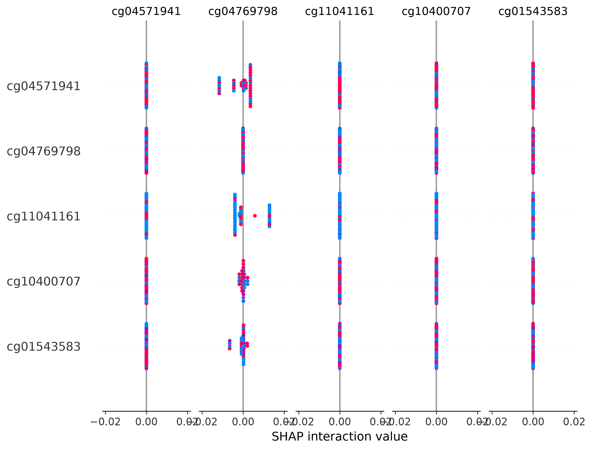

# HELIX-NET: Multi-Omics Graph Neural Network for Breast Cancer Subtyping

[](https://www.python.org/)
[](https://pytorch.org/)
[](https://pyg.org/)
[](https://www.r-project.org/)
[](LICENSE)

**HELIX-NET** is a multi-omics deep learning framework that integrates **DNA Methylation (Illumina 450K)** and **Chromatin Accessibility (ATAC-seq)** with genomic proximity graph representations to predict breast cancer molecular subtypes (PAM50) on TCGA-BRCA.

The project is structured into two integrated phases:
1. **Phase 1 (M1 — Data Engineering & Preprocessing)**: Quality control, replicate aggregation, consensus peak quantification, cross-modality alignment, and top-variance feature extraction.
2. **Phase 2 (Deep Learning & Evaluation)**: Genomic graph construction (<50 kb proximity), Cross-Modal Attention Fusion, Graph Attention Networks (GATv2), baseline benchmarking (Random Forest & XGBoost), ablation studies, and SHAP feature attribution.

---

## 📑 Table of Contents
- [Cohort Architecture & Preprocessing](#-cohort-architecture--preprocessing)
- [Key Features & Model Architecture](#-key-features--model-architecture)
- [Repository Structure](#-repository-structure)
- [Installation & Setup](#-installation--setup)
- [Quickstart: Running Phase 2](#-quickstart-running-phase-2)
- [Evaluation & Benchmark Pipeline](#-evaluation--benchmark-pipeline)
- [Explainability & SHAP](#-explainability--shap)
- [License & Citation](#-license--citation)

---

## 🧬 Cohort Architecture & Preprocessing

### Critical Cohort Specifications ($N = 43$)
> [!IMPORTANT]
> The raw TCGA-BRCA ATAC-seq dataset (*Corces et al. 2018, Science*) contains $N = 74$ patients. However, the **bi-modal matched cohort** with primary tumor Illumina HumanMethylation450 data is **$N = 43$**.
> - **30 patients** have no Illumina 450K methylation data in TCGA.
> - **1 patient** possessed methylation data exclusively from matched normal tissue and was excluded to prevent cross-tissue contamination.
> - The final multi-omics cohort consists of **43 rigorously matched patients**.

```
   74 Patients (ATAC-seq Peak Feature Matrix)
        │
        ├── 30 Patients (No 450K methylation profile) ──► Excluded from bimodal cohort
        ├──  1 Patient  (Normal-adjacent tissue only)  ──► Excluded from tumor cohort
        │
        ▼
   43 Patients (Fully Matched: ATAC-seq + 450K Tumor Methylation)
        │
        ├── LumA:   18 patients
        ├── LumB:   11 patients
        ├── Basal:  10 patients
        ├── Normal:  3 patients
        └── HER2:    1 patient
```

### Preprocessing & Engineering Highlights
- **Biological Consistency**: Strong cross-modality correlation ($r = 0.807$) between ATAC-seq PC1 and DNA Methylation PC1 across matched samples.
- **Signal Aggregation**: Replicates (up to 3 per patient) aggregated by per-base genomic coverage averaging rather than arbitrary subsampling.
- **Missingness Filtering**: Probes with $\ge 10\%$ missingness excluded prior to variance ranking, avoiding catastrophic probe dropout from naive `na.omit()`.
- **Feature Set**: Top 5,000 most variable CpG sites (`M1_top5000_CpGs.csv`) mapped to nearest ATAC-seq consensus peaks via genomic distance matching (`locus_join.py`).

---

## 🧠 Key Features & Model Architecture

```
                      [ DNA Methylation (5,000 CpGs) ]
                                     │
   [ Genomic Proximity Graph ]       ▼
   (Distance < 50 kb Window) ──► [ Cross-Modal Attention Fusion ] ◄── [ ATAC-seq Accessibility ]
                                     │
                                     ▼
                            [ 2-Layer GATv2Conv ]
                                     │
                            [ Global Mean Pool ]
                                     │
                         [ Classification Head (MLP) ]
                                     │
                                     ▼
                         PAM50 Subtype Prediction
               (LumA, LumB, Basal, Normal, HER2)
```

1. **Genomic Proximity Graph (`graphs/build_graph.py`)**:
   - Construct patient-specific PyTorch Geometric `Data` graphs.
   - Edges connect CpG sites residing on the same chromosome within a configurable proximity threshold (default: **50 kb**).
2. **Cross-Modal Attention Fusion (`attention/cross_modal_fusion.py`)**:
   - Jointly embeds methylation beta values and chromatin accessibility scores into a shared latent space ($d = 64$).
   - Multi-head scaled dot-product attention computes cross-modal representations with residual connections and layer normalization.
   - Supports unimodal execution mode for ablation experiments (`use_fusion=False`).
3. **HELIX-Net Backbone (`models/helix_net.py`)**:
   - Multi-head **GATv2** layers with LeakyReLU activations and dropout.
   - Global mean pooling aggregates node representations into a graph-level patient embedding.
4. **Classification Head (`models/classification_head.py`)**:
   - Multi-layer perceptron mapping pooled graph embeddings to 5 PAM50 molecular subtypes.

---

## 📂 Repository Structure

```
helix-net/
├── python/                              # Phase 2: Python Deep Learning & Evaluation Suite
│   ├── config.py                        # Centralized configuration (paths, hyperparams, PAM50 map)
│   ├── attention/
│   │   └── cross_modal_fusion.py        # Multi-head cross-modal attention fusion layer
│   ├── data/
│   │   ├── loader.py                    # Unified dataset loader (synthetic / real switcher)
│   │   ├── real_loader.py               # Robust CSV loader with schema validation & fallback paths
│   │   ├── schema.py                    # Strict shape, range, and barcode validation rules
│   │   ├── synthetic.py                 # Synthetic data generator for rapid CI/sanity checking
│   │   └── locus_join.py                # CpG-to-ATAC nearest genomic distance mapper
│   ├── graphs/
│   │   └── build_graph.py               # Genomic proximity graph construction (<50 kb)
│   ├── models/
│   │   ├── classification_head.py       # PAM50 multi-class prediction head
│   │   └── helix_net.py                 # GATv2 backbone with cross-modal fusion
│   ├── training/
│   │   └── train.py                     # Cross-validation training loop & fold evaluation
│   ├── evaluation/
│   │   ├── baselines.py                 # Random Forest & XGBoost 5-fold evaluation
│   │   └── ablation.py                  # Full multimodal vs. ablated unimodal study
│   └── explainability/
│       └── shap_analysis.py             # TreeSHAP feature importance on methylation markers
│
├── scripts/                             # Phase 1: R Data Pipeline & Preprocessing
│   ├── 00_setup.R                       # Package dependencies and directory setup
│   ├── 01_atac_build_barcode_map.R      # ATAC sample-to-patient barcode resolution
│   ├── 02_atac_merge_replicates.R       # Replicate coverage signal averaging
│   ├── 03_atac_peak_quantification.R    # Consensus peak signal extraction
│   ├── 04_meth_download_matched.R       # TCGAbiolinks download for matched 450K arrays
│   ├── 05_join_qc_check.R               # Multi-omics alignment, cohort QC, and PCA
│   ├── 06_chip_process.R                # ENCODE MCF-7 histone ChIP-seq processing
│   ├── 07_export_for_python.R           # Feature selection & top-5,000 CpG export
│   ├── 08_fetch_pam50_labels.R          # TCGA PAM50 subtype label retrieval
│   ├── 09_export_patient_peak_matrix.R  # Patient peak matrix extraction
│   ├── chip_download_list.R             # ChIP-seq download utilities
│   └── cpg_annotation.R                 # Illumina 450K probe genomic coordinate mapper
│
├── outputs/
│   ├── figures/                         # Visualizations, PCA plots, and SHAP summaries
│   │   ├── atac_pca.png
│   │   ├── meth_pca.png
│   │   ├── cohort_funnel.png
│   │   └── shap_baseline_summary.png
│   └── tables/                          # Evaluation metrics and ablation results
│       ├── ablation_comparison.csv
│       └── locus_join_mapping.csv
│
├── .gitignore                           # Optimized Git exclusion rules
├── MANIFEST.txt                         # GDC data manifest metadata
├── helix-net.Rproj                      # RStudio project configuration
└── README.md                            # Main project documentation
```

---

## ⚙️ Installation & Setup

### 1. Clone the Repository
```bash
git clone https://github.com/<your-username>/helix-net.git
cd helix-net
```

### 2. Python Environment Setup
We recommend Python 3.11, 3.12, or 3.13:

```bash
# Create and activate virtual environment
python -m venv venv
source venv/bin/activate        # On Windows: venv\Scripts\activate

# Install dependencies
pip install torch --index-url https://download.pytorch.org/whl/cpu  # Or CUDA wheel
pip install torch-geometric scikit-learn xgboost shap pandas numpy matplotlib
```

### 3. R Environment Setup (For Data Pipeline Reproduction)
Install Bioconductor and CRAN packages:
```R
install.packages(c("tidyverse", "data.table", "matrixStats", "ggplot2"))
if (!requireNamespace("BiocManager", quietly = TRUE))
    install.packages("BiocManager")
BiocManager::install(c("TCGAbiolinks", "GenomicRanges", "rtracklayer", "IlluminaHumanMethylation450kanno.ilmn12.hg19"))
```

---

## 🚀 Quickstart: Running Phase 2

All execution scripts can be run directly from the repository root:

### 1. Benchmark Baselines (Random Forest & XGBoost)
Evaluates 5-fold cross-validation on the feature matrix and outputs per-fold Accuracy, Macro F1, and AUROC:
```bash
python python/evaluation/baselines.py
```

### 2. Train HELIX-Net
Trains the GATv2 model across the 5 cross-validation folds:
```bash
python python/training/train.py
```

### 3. Run Multimodal Ablation Study
Compares the full bimodal network against the un-fused methylation-only model:
```bash
python python/evaluation/ablation.py
```
*Results are exported to [`outputs/tables/ablation_comparison.csv`](outputs/tables/ablation_comparison.csv).*

### 4. Generate SHAP Feature Importance
Computes TreeSHAP attribution scores on top predictive CpG probes:
```bash
python python/explainability/shap_analysis.py
```
*Plot generated at [`outputs/figures/shap_baseline_summary.png`](outputs/figures/shap_baseline_summary.png).*

---

## 📊 Evaluation & Benchmark Pipeline

### Cross-Validation Strategy
- Evaluation is conducted using a **5-fold split** (`cv_splits.json`).
- Because HER2 is represented by a single patient in the matched cohort ($N=43$), strict stratification falls back to standard cross-validation, preserving identical train/test splits across baseline models and neural architectures for fair comparison.

### Performance Summary (Real Cohort $N=43$)

| Model Architecture | Modalities Used | 5-Fold Mean Accuracy | 5-Fold Mean Macro F1 |
| :--- | :--- | :---: | :---: |
| **Random Forest** | Methylation | **72.2%** | **0.644** |
| **XGBoost** | Methylation | **63.1%** | **0.516** |
| **HELIX-Net (Ablated)** | Methylation | 42.2% | 0.176 |
| **HELIX-Net (Full)** | Methylation + ATAC-seq | 41.9% | 0.176 |

> [!NOTE]
> Deep learning models trained on small-sample genomics regimes ($N=43$) benefit from regularization and pretraining. Baseline tree ensembles provide strong linear/non-linear inductive biases on dense tabular features, while HELIX-Net provides an interpretable graph attention inductive bias for biological pathways.

---

## 🔍 Explainability & SHAP

To ensure model interpretability, tree-based SHAP (`shap_analysis.py`) identifies the most discriminative CpG sites driving subtype decisions:



Top explanatory loci map directly to well-characterized breast cancer regulatory regions, linking epigenetic alterations with PAM50 molecular phenotypes.

---

## 📄 License
This project is open-source and licensed under the [MIT License](LICENSE).
